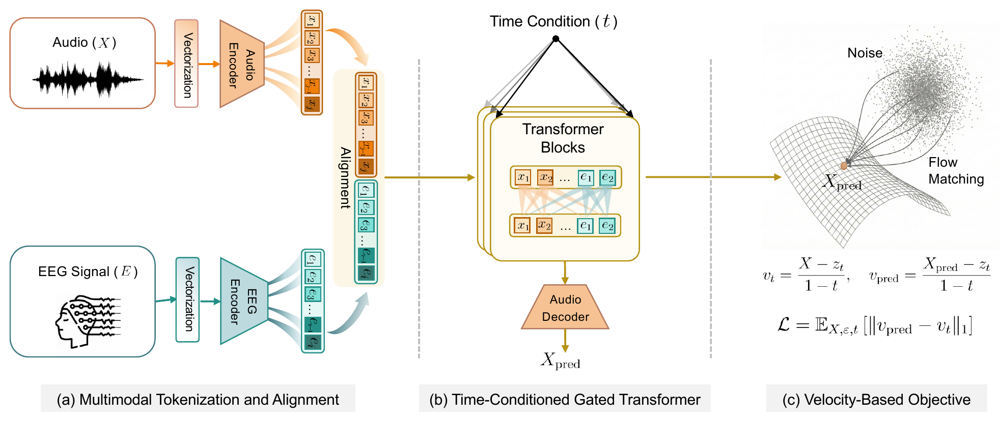

<div align="center">

  <h2>NeuroSonic: Conditional Flow Matching<br> for EEG-to-Speech Reconstruction</h2>

  <h3>✨ MICCAI 2026 ✨</h3>
  
  <br>
  
  <p>
    Wenhao Gao<sup>1</sup>&nbsp;
    Yifan Wang<sup>1</sup>&nbsp;
    Yijia Ma<sup>2</sup>&nbsp;
    Carl Yang<sup>3</sup>&nbsp;
    Wen Li<sup>2</sup>&nbsp;
    Chenyu You<sup>1</sup>
  </p>

  <p>
    <sup>1</sup> Stony Brook University &nbsp;&nbsp;
    <sup>2</sup> University of Texas Health Center at Houston &nbsp;&nbsp;
    <sup>3</sup> Emory University
  </p>

  <p>
    <a href="">
      
    </a>
    <a href="https://github.com/ghh1251/my_miccai">
      
    </a>
    <a href="">
      
    </a>
    <a href="https://www.python.org/downloads/">
      
    </a>
    <a href="https://pytorch.org/">
      
    </a>
  </p>

</div>

## Method

NeuroSonic formulates EEG-to-speech reconstruction as **conditional acoustic transport**. Given paired EEG-audio samples `(E, X)`, the model constructs a corrupted acoustic state and learns a velocity field that transports it toward clean speech under EEG conditioning. At inference, the learned probability-flow ODE is integrated from `t=0` to `t=1` using a fixed-step Heun solver, yielding deterministic reconstruction conditioned on neural activity.

<p align="center">
  
</p>
<p align="center"><sub><em>Figure 1. EEG and audio are partitioned into patches, projected into a shared latent space, processed by a time-conditioned gated Transformer, and decoded through a velocity-based objective for conditional acoustic transport.</em></sub></p>

## Installation

The released code targets Python 3.10, PyTorch 2.5.1, and CUDA 12.4.

```bash
conda env create -f environment.yaml
conda activate neurosonic
pip install -e .
```

Alternatively, install the pinned Python dependencies directly:

```bash
pip install -r requirements.txt
pip install -e .
```

## Data Preparation

NeuroSonic currently supports two dataset backends:

- `eav_input_images`: loads EAV-style prepared per-subject `sub-XX_eeg.npy` and `sub-XX_audio.npy` files.
- `paired_index`: loads paired EEG/audio arrays using an index file with `subject_id`, `eeg_idx`, and `audio_idx` arrays.

The datasets used in the paper are available from [CineBrain](https://huggingface.co/datasets/Fudan-fMRI/CineBrain) and [EAV](https://zenodo.org/records/13799131).

The prepared directory should contain files such as:

```text
prepared_eeg_audio/
├── sub-01_eeg.npy
├── sub-01_audio.npy
├── sub-01_y.npy
├── ...
└── manifest.json
```

## Training

The example below follows the EAV setting used by the released training script.

```bash
export EAV_PREPARED_DIR=/path/to/EAV/prepared_eeg_audio
export OUTPUT_DIR=./outputs/neurosonic_eav
bash scripts/train_eav.sh
```

The command trains `NeuroSonic-L` for 400 epochs with AdamW optimization, cosine scheduling, EMA tracking, and online generation evaluation.

## Evaluation

Run generation from a checkpoint:

```bash
export EAV_PREPARED_DIR=/path/to/EAV/prepared_eeg_audio
export CHECKPOINT_DIR=./outputs/neurosonic_eav
export OUTPUT_DIR=./outputs/neurosonic_eav_eval
bash scripts/evaluate_eav.sh
```

Evaluation writes paired generated and target files named `*_g.npy` and `*_t.npy`.

## Repository Layout

```text
neurosonic/
├── neurosonic/
│   ├── model.py                 # time-conditioned gated Transformer
│   ├── flow_matching.py         # conditional flow matching wrapper and ODE generation
│   ├── engine.py                # training and generation loops
│   └── datasets/                # paired-index and EAV prepared datasets
├── scripts/
│   ├── train_eav.sh
│   └── evaluate_eav.sh
├── docs/
│   └── index.html
└── assets/
```

## Citation

If you find NeuroSonic useful in your research, please cite:

```bibtex
@inproceedings{gao2026neurosonic,
  title     = {NeuroSonic: Conditional Flow Matching for EEG-to-Speech Reconstruction},
  author    = {Gao, Wenhao and Wang, Yifan and Ma, Yijia and Yang, Carl and Li, Wen and You, Chenyu},
  booktitle = {Medical Image Computing and Computer Assisted Intervention (MICCAI)},
  year      = {2026}
}
```

The arXiv, model, and dataset links will be updated once they are available.

## Acknowledgements

This repository includes `third_party/kadtk` for audio distribution metrics and related audio embedding utilities. Please also follow the license terms of third-party components used by the evaluation stack.
